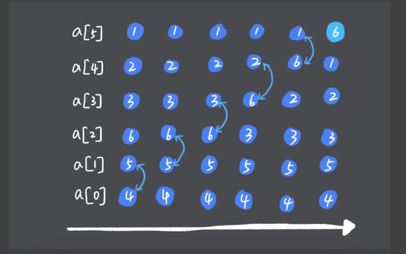
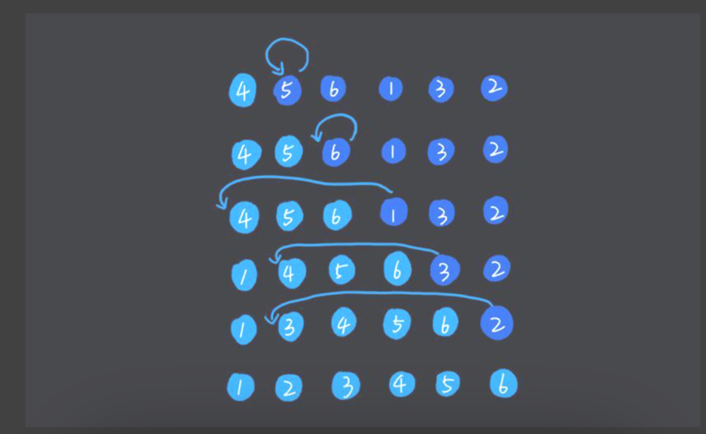
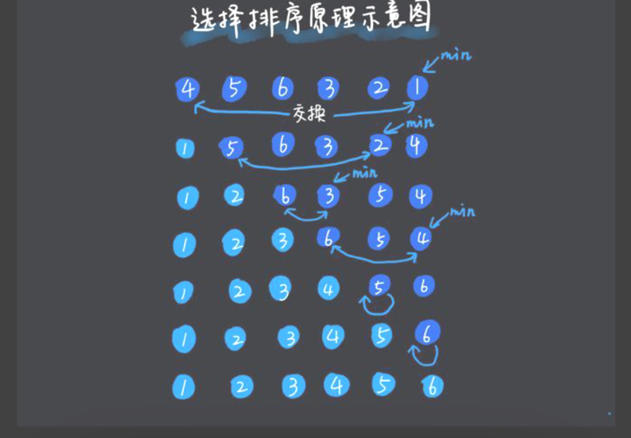
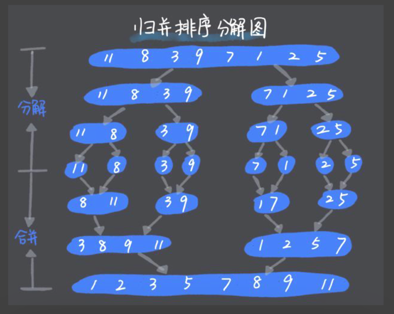
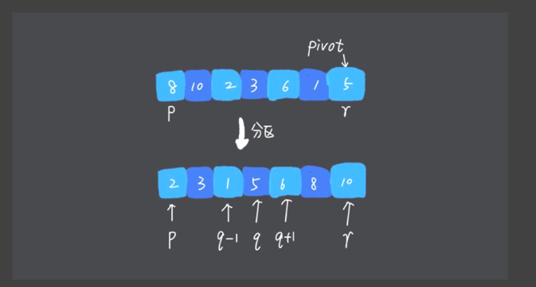

# 排序算法概述

排序算法的内存消耗：排序算法的内存消耗可以通过空间复杂度衡量

<b>原地排序（Sorted in place）：</b>指空间复杂度是O(1)的算法

排序算法的稳定性：如果待排序的序列中存在值相等的元素，经过排序之后，相等元素之间原有的顺序不变，那么这个排序算法就是稳定的。
<ul><li>如果算法是相邻元素进行比较替换则不会破会稳定性，如果是向插入排序这样的跨越相邻替换则会破坏稳定性</li></ul>

排序算法的执行效率，从以下几个方面衡量：

<ul><li>最好情况、最坏情况、平均情况时间复杂度</li><li>时间复杂度系数、常数、低阶</li><li>比较次数和交换（或移动）次数</li></ul>

# 冒泡排序

# 插入排序

# 选择排序

# 归并排序

改排序采用分治思想，把大的问题分解为小的子问题来求解，最终在把小问题的解合并到大的问题上

关键在于编写merge函数
<b>递归代码编写技巧：</b>
<ul>
<li>
分析出递归公式
</li>
<li>
找到终止条件
</li>
<li>
将公式翻译成代码
</li>
</ul>

# 快速排序

快排核心是确定分区点（pivot），在分区点左边的都小于他，在他右边的都大于他
关键在于编写partition函数
注意与归并排序区分开，一个是数据合并，一个是分区

代码哨兵机制，通过对边界值进行赋值与代码进行判断，可以提供代码执行效率